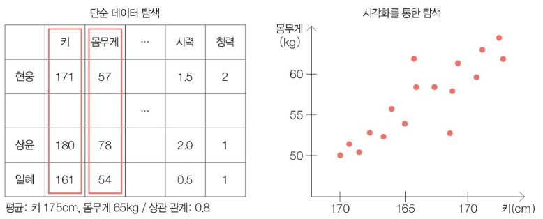

**🧐 탐색적 데이터 분석 (EDA, Expolatory Data Anlysis)**  
데이터의 정보를 파악하며 문제 해결에 필요한 힌트를 분석하는 과정

<br>

## 🚀 대략적인 데이터 파악

데이터 분석은 `raw data*`를 열어보는 것에서부터 시작  

<br>

```
* Raw Data  
아직 분석에 활용된 적이 없는 혹은 정제되지 않은 데이터  
```

<br>

### 1️⃣ 데이터의 출처와 주제에 대한 이해  
   데이터의 이름, 구성 요소, 그리고 데이터의 출처와 주제 등에 대해 조사

<br>

### 2️⃣ 데이터의 크기 파악  
  - 데이터의 대략적인 양이나 개수를 알아보는 단계  
  - 데이터의 크기에 따라 특별한 종류의 `샘플링*`이 필요하기도 하고, 어떤 방식으로 데이터를 처리할지도 달라질 수 있기 때문
  
<br>

```
* 샘플링(Sampling)  
- 어떤 자료로부터 일부의 값을 추출하는 행위
- 데이터가 너무 크거나 전체 데이터를 사용할 수 없는 경우, 
  샘플링된 데이터를 분석하는 것이 좋은 대안이 될 수 있음
```

<br>

### 3️⃣ 데이터의 구성 요소(피처) 파악
- 피처(feature): 데이터를 구성하는 요소
- 어떤 데이터로 구성되어 있는지, 데이터로부터 어떤 정보들을 알아낼 수 있을지에 대한 대략적인 정보 확인 및 목표 설정

<br>


## 🚀 데이터 속성 탐색

### 1️⃣ 피처 속성 탐색

- 속성 탐색 과정에서 가장 중요한 것은 **데이터에 질문을 던지는 것**
- 데이터로부터 어떤 정보를 얻을 수 있을지에 대해 고민하고 질문하는 것이 핵심
- `예: 학급의 신체검사 결과 데이터 (feature: 키, 몸무게, ..., 시력, 청력)`
  - 학급의 평균 키 계산
  - 표준편차, 중앙값, 데이터의 사분위 수 등의 통계값 확인  
    👉 피처의 측정 가능한 **정량적 속성** 정의

<br>

### 2️⃣ 피처 간의 상관 관계 탐색

- 여러 개의 피처가 서로에게 미치는 영향력 파악
- 위의 예시에서 '비만'에 대해 '몸무게'와 '키'가 모두 관계가 있듯이, 피처끼리의 상관 관계 또한 살펴보아야 함
- 피처 간의 공분산, 혹은 상관 계수와 같은 개념을 포함

<br>

## 🚀 탐색한 데이터 시각화

- 데이터 시각화는 수치적 자료만 가지고 파악하기 힘든 **패턴이나 인사이트**를 발견하는 데 유용
- 아래 교재의 예시처럼 키와 몸무게의 상관 관계를 더 직관적으로 파악할 수 있음

<br>



<br>

## 🚀 EDA 예제 실습 (github)

[01.1.2 멕시코풍 프랜차이즈 chipotle 주문 데이터 분석](https://github.com/eseulLee/python-data-anlysis/blob/b5b91dc5e994f02814869c022f6fcb9de9c3ef4a/01.1.2%20%EB%A9%95%EC%8B%9C%EC%BD%94%ED%92%8D%20%ED%94%84%EB%9E%9C%EC%B0%A8%EC%9D%B4%EC%A6%88%20chipotle%20%EC%A3%BC%EB%AC%B8%20%EB%8D%B0%EC%9D%B4%ED%84%B0%20%EB%B6%84%EC%84%9D.ipynb){: target="_blank"}  

01.1.3 국가별 음주 데이터 분석(추가예정)

<br><br>
